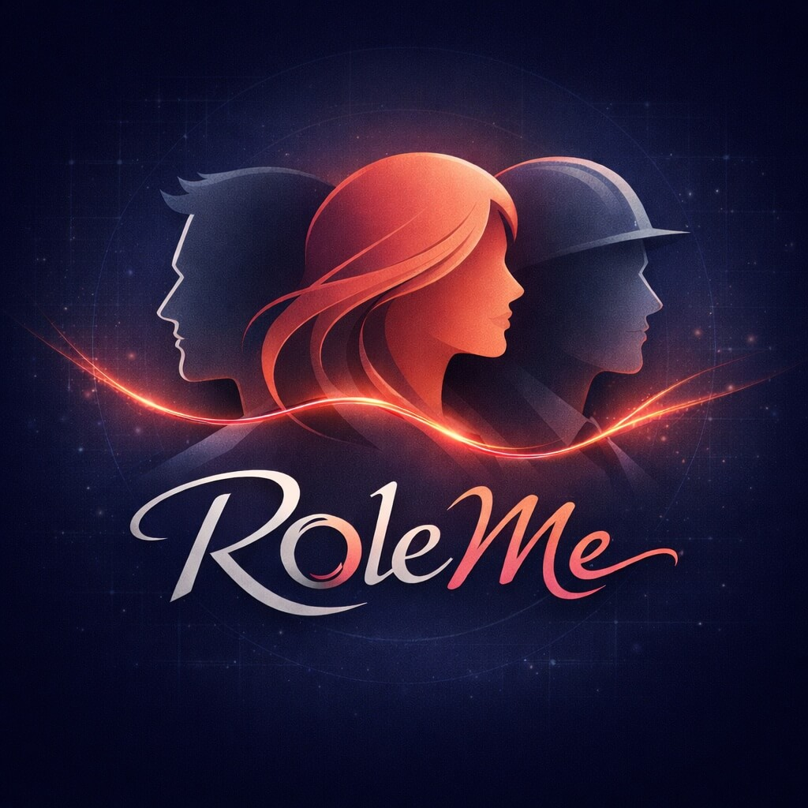

<div align="center">



# roleMe

### 让 AI 记住你是谁，而不只是你刚刚说了什么

把身份、记忆、风格与项目上下文整理成一个可加载、可切换、可维护、可导出的角色包。

</div>

事情的起因其实很朴素。

老板想让我把这些年的工作经验、协作习惯和思考方式整理出来，最好还能给大家做做培训。  
我第一反应是：培训可以做，但总不能每次都从头讲到尾吧。

既然迟早都要沉淀，  
那不如一步到位，做成一个真的能被 AI 反复调用、反复理解、反复协作的 skill。

于是，`roleMe` 就这么出现了。

大多数 AI 工作流都很擅长理解“这一轮对话”，却不擅长持续理解“这个用户”。

它会忘记你的表达习惯、协作偏好、长期背景，以及你正在推进的项目。于是你不得不一遍又一遍重新介绍自己，重新交代上下文，重新校准协作方式。

`roleMe` 想补上的，就是这一层。

它不是让助手扮演一个人设，也不是做一次性的 prompt cosplay。  
它做的是另一件更实用的事：把与你有关的稳定信息沉淀成结构化角色包，让助手在不同会话里依然能更稳定地理解你。

## 现在怎么用

先安装：

```bash
npx skills add https://github.com/zhaocaho/roleMe --skill roleme
```

然后你其实只需要记住两条命令：

```text
/roleMe
/roleMe <角色名>
```

第一次使用时：

```text
/roleMe
```

它会带你创建角色，或者让你加载一个已经存在的角色。

以后你可以直接这样进入你的角色：

```text
/roleMe <角色名>
```

如果这个角色还不存在，它就会顺手为你开始初始化。

创建完成后，再执行一次：

```text
/roleMe <角色名>
```

从那一刻开始，你就不需要每次都从“重新介绍自己”开始了。

## 你会感受到什么

- 少一点重复介绍自己
- 少一点反复校准表达方式
- 少一点“上一轮说得挺好，这一轮又变了”
- 多一点连续感
- 多一点被理解的感觉
- 多一点像长期搭档，而不是一次性工具的协作体验

我一直觉得，AI 真正的问题不只是“聪不聪明”，而是“它有没有持续地理解你”。

如果每一次协作都像第一次见面，那再强的模型，也很难成为真正趁手的伙伴。

`roleMe` 想做的，不是让 AI 看起来更会说话。  
而是让 AI 更知道它正在和谁一起工作。

## 适合谁

- 希望 AI 在长期协作里持续理解自己的重度用户
- 经常在多个项目之间切换，希望上下文更有边界的人
- 想把 prompt、偏好、记忆和项目规则做成可维护资产的 skill 作者
- 想研究“用户角色上下文”这一层应该如何落地的人

## 我对它的期待

今天，`roleMe` 还是一个 skill。

但我真正想做的，不只是一个小工具。

我想把它慢慢做成一种更稳定的用户身份层：  
不管你在哪个 AI 产品里，不管你切换了多少次会话，不管你在处理的是写作、开发、研究还是项目协作，你都不需要一次次重新训练一个“新的自己”。

我希望有一天，我们和 AI 的关系，不再是不断重复指令、不断修正理解、不断重建上下文。  
而是你一进入对话，它就已经知道你是谁，你在意什么，你怎么思考，你希望怎样被协作。

如果 AI 会成为未来工作的基础设施，  
那“你自己”也应该有一层属于你的基础设施。

对我来说，`roleMe` 想做的，就是这件事。

## 最后

如果你也受够了每次都要重新告诉 AI 你是谁、你喜欢怎么协作、你正在做什么项目，  
那 `roleMe` 也许正是你缺的那一层。

它不一定一开始就很完美。  
但我相信，这会是未来人与 AI 长期协作里非常重要的一块拼图。

如果你也认同这件事，欢迎来试试它。
