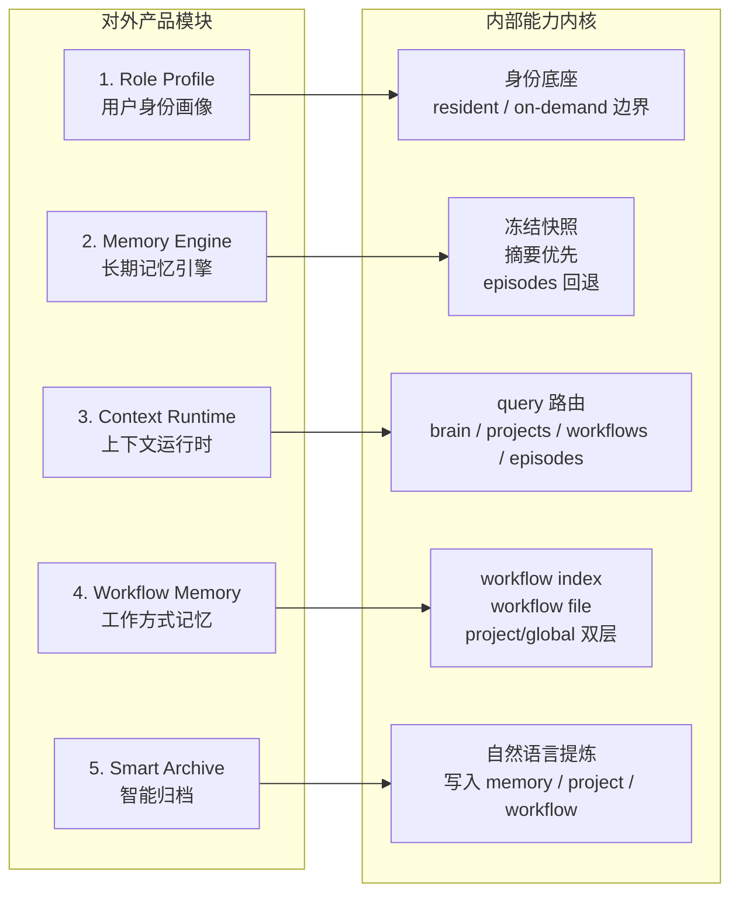

# roleMe 产品模块边界图

这份文档用于沉淀 `roleMe` 当前最值得保留和对外表达的产品模块边界。

核心目标不是把 `23-workspace` 整体搬进来，而是提炼其中最有产品价值的精华能力：

- 用户身份画像
- 长期记忆引擎
- 上下文运行时
- 工作方式记忆
- 智能归档

## 对外产品模块与内部能力映射

## 模块说明

### 1. Role Profile

产品入口模块，用来表达“AI 正在和谁协作”。

它对应的内部能力不是单个文件，而是角色的常驻层和按需层边界定义。没有这一层，`roleMe` 会退化成更大的 prompt 包，而不是稳定的用户上下文系统。

### 2. Memory Engine

这是 `roleMe` 的基础设施层，负责长期记忆的稳定性。

重点不是“记住更多”，而是：

- 会话开始加载冻结快照
- 优先读取摘要层
- 细节不常驻，按需回退到 episodes
- 写入后立即持久化

### 3. Context Runtime

这是让系统“少读但读对”的关键模块。

当用户发出请求时，系统不应把所有上下文一次性塞给模型，而是根据 query 判断应该去哪里取信息：

- `brain`
- `projects`
- `workflows`
- `episodes`

### 4. Workflow Memory

这是 `roleMe` 最值得拉开差异化的模块。

它不只是记住“用户是谁”，还开始记住“用户怎么做事”。这部分能力的核心不是重型流程系统，而是：

- `workflow index`
- 单个 workflow 文档
- project/global 双层组织

延伸阅读：[`workflow-memory-extraction.md`](workflow-memory-extraction.md)

### 5. Smart Archive

这是增强层，不应喧宾夺主。

它的作用是把用户的自然表达自动提炼后，落到合适的位置：

- `memory`
- `project`
- `workflow`

这层很重要，但它更像增长器，而不是底层内核。

## 收敛后的产品表达

`roleMe` 不应该被定义成“大而全的 AI 工作空间”，更适合的表达是：

> `roleMe = 身份底座 + 记忆运行时 + 上下文路由 + 工作方式记忆`

如果再面向外部做一句话介绍，可以写成：

> `roleMe` 是一个面向长期协作的用户上下文运行时，包含身份画像、长期记忆、上下文路由和工作方式记忆。
